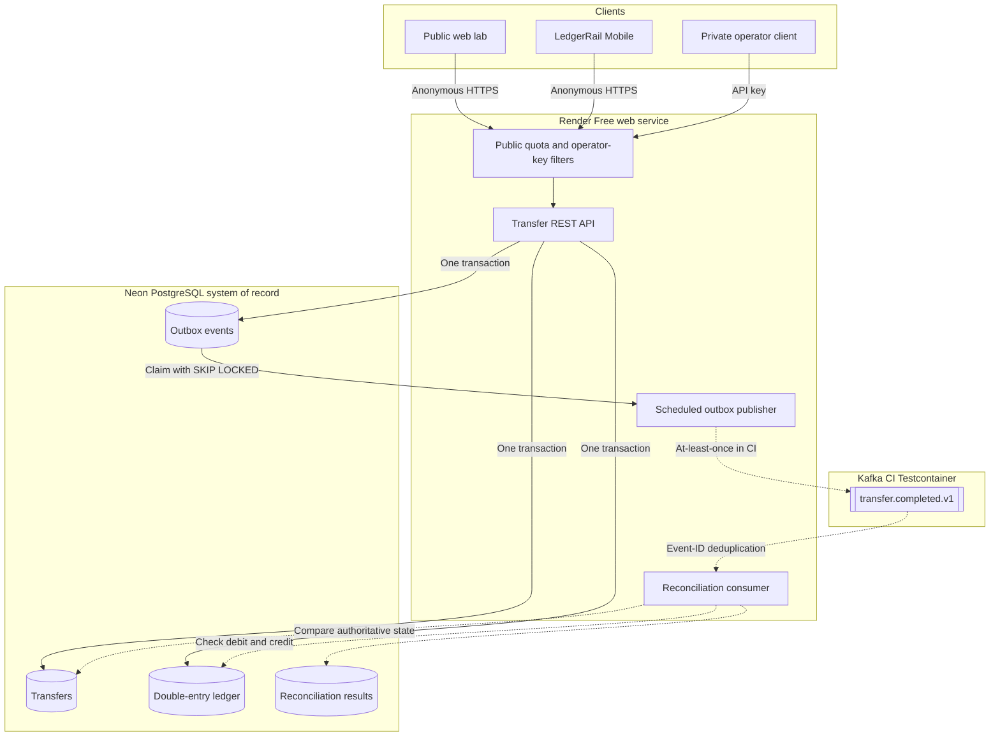

# LedgerRail Core

[](https://github.com/oranegonzales/ledgerrail-core/actions/workflows/ci.yml)

LedgerRail Core is a sandbox payment API built to demonstrate reliable Java backend engineering. It creates simulated pay-ins and pay-outs, records an atomic two-entry ledger, protects retries with idempotency keys, and writes integration events to a transactional outbox.

The project never moves real money and must only use synthetic data.

## Live deployment

- Web dashboard: [ledgerrail-core.onrender.com](https://ledgerrail-core.onrender.com/)
- API metadata: [ledgerrail-core.onrender.com/api-info](https://ledgerrail-core.onrender.com/api-info)
- Health: [ledgerrail-core.onrender.com/actuator/health](https://ledgerrail-core.onrender.com/actuator/health)
- Source: [github.com/oranegonzales/ledgerrail-core](https://github.com/oranegonzales/ledgerrail-core)

The synthetic transfer demo is public and needs no account or API key. Database-backed daily write quotas and per-client request limits bound abuse. Recovery and operator endpoints still require a private portfolio key. The Render Free instance can take about one minute to wake after inactivity.

## Current milestone

Version 0.3.0 includes:

- Java 21 and Spring Boot 3.5
- Responsive same-origin web dashboard and API lab
- PostgreSQL schema management with Flyway
- Idempotent transfer creation
- Balanced debit and credit ledger entries
- Transactional outbox records and scheduled Kafka publishing
- Concurrent publisher claims with `FOR UPDATE SKIP LOCKED`
- Producer acknowledgements, bounded retries, stale-claim recovery, and terminal failure state
- RFC 9457-style API errors
- Correlation IDs for request tracing
- Prometheus metrics, health checks, and hardened browser response headers
- PostgreSQL and Kafka Testcontainers integration tests
- Safe anonymous demo access with persistent write quotas and burst limits
- Concurrent idempotency verification across 24 simultaneous callers
- Kafka reconciliation with event-ID de-duplication and mismatch records
- Private failed-outbox inspection and operator replay
- Multi-stage Docker build
- Render and Neon free-tier deployment configuration

Kafka publishing is broker-neutral and intentionally disabled in the free Render deployment. GitHub Actions runs the complete outbox-to-Kafka-to-reconciliation path against ephemeral PostgreSQL and Apache Kafka Testcontainers, including duplicate delivery. This verifies the integration without a time-limited hosted broker. OpenTelemetry tracing belongs to a later milestone; the native Android client is available in [LedgerRail Mobile](https://github.com/oranegonzales/ledgerrail-mobile).

## Architecture



The transfer, both ledger entries, and the outbox event are committed in one database transaction. PostgreSQL is the system of record. When a broker is configured, Kafka distributes committed events with at-least-once delivery, so downstream consumers deduplicate by event ID. The dotted Kafka path is exercised in CI and is not enabled in the public free-tier deployment.

## Run locally

Copy `.env.example` to `.env`, replace both secrets, and run:

```bash
docker compose up --build
```

The application will be available at `http://localhost:8080` and its health endpoint at `http://localhost:8080/actuator/health`.

## Create a sandbox transfer

```bash
curl -X POST http://localhost:8080/api/v1/transfers \
  -H "Content-Type: application/json" \
  -H "Idempotency-Key: transfer-demo-001" \
  -d '{"accountId":"6aa6aa37-52ea-4533-b319-339ecd090c4f","type":"PAY_IN","amount":125.50,"currency":"JMD"}'
```

Repeating the exact request returns the original transfer and the response header `Idempotency-Replayed: true`. Reusing the same key for a different amount, currency, account, or transfer type returns HTTP 409.

## API

Transfer endpoints are public because all data is synthetic. Sending a valid `X-Portfolio-Key` bypasses public-demo quotas for operator testing. A supplied but invalid key is rejected.

| Method | Path | Purpose |
| --- | --- | --- |
| `POST` | `/api/v1/transfers` | Create or replay a sandbox transfer |
| `GET` | `/api/v1/transfers/{id}` | Retrieve a transfer |
| `GET` | `/api/v1/transfers?accountId={accountId}` | List an account's transfers |
| `GET` | `/api/v1/transfers/{id}/ledger-entries` | Retrieve debit and credit entries |
| `GET` | `/api/v1/operations/reconciliation` | Inspect reconciliation results; operator key required |
| `GET` | `/api/v1/operations/outbox/failed` | List failed outbox events; operator key required |
| `POST` | `/api/v1/operations/outbox/{eventId}/replay` | Requeue a failed event; operator key required |
| `GET` | `/actuator/health` | Read public health status |
| `GET` | `/actuator/prometheus` | Read Prometheus metrics |

## Verified live behavior

The Render and Neon deployment was smoke-tested on July 14, 2026:

- A new pay-in returned HTTP 201 with status `COMPLETED`.
- Repeating the same request returned HTTP 200 and `Idempotency-Replayed: true` with the original transfer ID.
- The transfer produced exactly one debit and one credit for the same amount and currency.
- The previous private-key transfer path returned HTTP 401 without the key; version 0.3 replaces that recruiter-hostile flow with a rate-limited public demo.
- The public health endpoint returned `UP`.

## Test

Java 21, Maven 3.6.3 or later, and Docker are required.

```bash
mvn verify
```

The integration tests start isolated PostgreSQL 17 and Kafka containers. They verify public quota enforcement, private operator protection, 24-way concurrent idempotency, ledger balance creation, failed-event replay, Kafka delivery, reconciliation, event-ID de-duplication, and mismatch detection.

## Free public deployment

InfinityFree is not compatible with this service because it provides PHP and MySQL hosting rather than a persistent Java and Docker runtime.

The active deployment target is Render Free for the Dockerized application and Neon Free for PostgreSQL. No managed Kafka trial is required: Kafka remains disabled on Render and the publisher is verified with a disposable broker in GitHub Actions. See [`docs/HOSTING.md`](docs/HOSTING.md) for hosting and uptime tradeoffs and [`docs/KAFKA.md`](docs/KAFKA.md) for the broker-neutral delivery design.

The free Render service sleeps after a period without traffic, so the first request can take about one minute. This limitation must remain documented in the public demo.

## Roadmap

1. Add OpenTelemetry traces and trace-linked structured logs.
2. Add a reconciliation summary to the public dashboard without exposing operator controls.
3. Connect a managed broker only when a durable non-trial environment is available.
