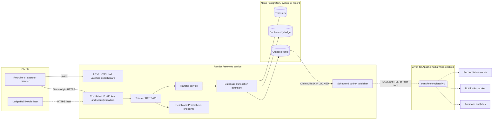

# LedgerRail Core

[](https://github.com/oranegonzales/ledgerrail-core/actions/workflows/ci.yml)

LedgerRail Core is a sandbox payment API built to demonstrate reliable Java backend engineering. It creates simulated pay-ins and pay-outs, records an atomic two-entry ledger, protects retries with idempotency keys, and writes integration events to a transactional outbox.

The project never moves real money and must only use synthetic data.

## Live deployment

- Web dashboard: [ledgerrail-core.onrender.com](https://ledgerrail-core.onrender.com/)
- API metadata: [ledgerrail-core.onrender.com/api-info](https://ledgerrail-core.onrender.com/api-info)
- Health: [ledgerrail-core.onrender.com/actuator/health](https://ledgerrail-core.onrender.com/actuator/health)
- Source: [github.com/oranegonzales/ledgerrail-core](https://github.com/oranegonzales/ledgerrail-core)

Protected API endpoints require a private portfolio key that is not published. The Render Free instance can take about one minute to wake after inactivity.

## Current milestone

Version 0.2.0 includes:

- Java 21 and Spring Boot 3.5
- Responsive same-origin web dashboard and API lab
- PostgreSQL schema management with Flyway
- Idempotent transfer creation
- Balanced debit and credit ledger entries
- Transactional outbox records and scheduled Kafka publishing
- Concurrent publisher claims with `FOR UPDATE SKIP LOCKED`
- Producer acknowledgements, bounded retries, stale-claim recovery, and terminal failure state
- RFC 9457-style API errors
- Correlation IDs for request tracing
- Prometheus metrics, health checks, and hardened browser response headers
- PostgreSQL and Kafka Testcontainers integration tests
- Multi-stage Docker build
- Render and Neon free-tier deployment configuration

The Aiven connection is opt-in and remains disabled in the live Render environment until private SASL credentials and the CA certificate are installed. Reconciliation, OpenTelemetry tracing, and the Android client belong to later milestones.

## Architecture



The transfer, both ledger entries, and the outbox event are committed in one database transaction. PostgreSQL is the system of record. Kafka distributes committed events with at-least-once delivery, so downstream consumers deduplicate by event ID.

## Run locally

Copy `.env.example` to `.env`, replace both secrets, and run:

```bash
docker compose up --build
```

The application will be available at `http://localhost:8080` and its health endpoint at `http://localhost:8080/actuator/health`.

## Create a sandbox transfer

```bash
curl -X POST http://localhost:8080/api/v1/transfers \
  -H "Content-Type: application/json" \
  -H "X-Portfolio-Key: your-local-api-key" \
  -H "Idempotency-Key: transfer-demo-001" \
  -d '{"accountId":"6aa6aa37-52ea-4533-b319-339ecd090c4f","type":"PAY_IN","amount":125.50,"currency":"JMD"}'
```

Repeating the exact request returns the original transfer and the response header `Idempotency-Replayed: true`. Reusing the same key for a different amount, currency, account, or transfer type returns HTTP 409.

## API

Every `/api/` request requires `X-Portfolio-Key`.

| Method | Path | Purpose |
| --- | --- | --- |
| `POST` | `/api/v1/transfers` | Create or replay a sandbox transfer |
| `GET` | `/api/v1/transfers/{id}` | Retrieve a transfer |
| `GET` | `/api/v1/transfers?accountId={accountId}` | List an account's transfers |
| `GET` | `/api/v1/transfers/{id}/ledger-entries` | Retrieve debit and credit entries |
| `GET` | `/actuator/health` | Read public health status |
| `GET` | `/actuator/prometheus` | Read Prometheus metrics |

## Verified live behavior

The Render and Neon deployment was smoke-tested on July 14, 2026:

- A new pay-in returned HTTP 201 with status `COMPLETED`.
- Repeating the same request returned HTTP 200 and `Idempotency-Replayed: true` with the original transfer ID.
- The transfer produced exactly one debit and one credit for the same amount and currency.
- Requests without the portfolio API key returned HTTP 401.
- The public health endpoint returned `UP`.

## Test

Java 21, Maven 3.6.3 or later, and Docker are required.

```bash
mvn verify
```

The integration tests start isolated PostgreSQL 17 and Kafka containers. They verify idempotent replay, idempotency conflicts, API-key protection, ledger balance creation, one outbox event per new transfer, Kafka delivery, and the final `PUBLISHED` state.

## Free public deployment

InfinityFree is not compatible with this service because it provides PHP and MySQL hosting rather than a persistent Java and Docker runtime.

The active deployment target is Render Free for the Dockerized application and Neon Free for PostgreSQL. The code is ready for Aiven Free Kafka, but Kafka remains disabled until its private connection values are added to Render. See [`docs/HOSTING.md`](docs/HOSTING.md) for hosting and [`docs/KAFKA.md`](docs/KAFKA.md) for Kafka setup and delivery semantics.

The free Render service sleeps after a period without traffic, so the first request can take about one minute. This limitation must remain documented in the public demo.

## Roadmap

1. Connect the deployed publisher to Aiven Free Kafka.
2. Add a reconciliation consumer with event-ID de-duplication.
3. Add failure-injection tests and an operator replay command for failed events.
4. Add OpenTelemetry traces and Grafana dashboards.
5. Build LedgerRail Mobile with Kotlin and Jetpack Compose.
